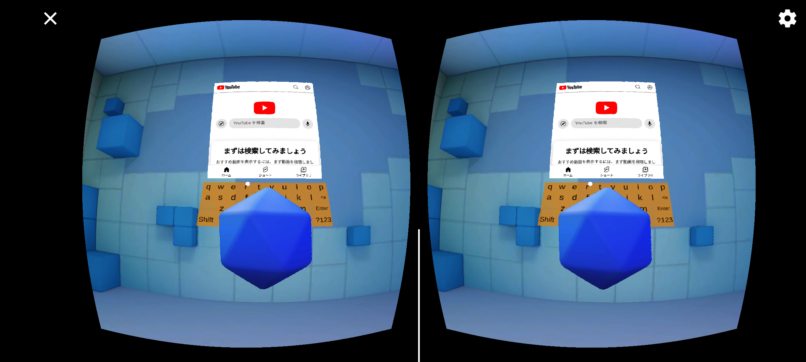

# google-cardborad-webview-sample

Sample Unity project for using [TLabWebView](https://github.com/TLabAltoh/TLabWebView) (3D web browser / 3D WebView plugin) with google-cardborad-sdk. Currently, this is a very rough example project. Just display webview on google-cardborad-sample.

</img>
